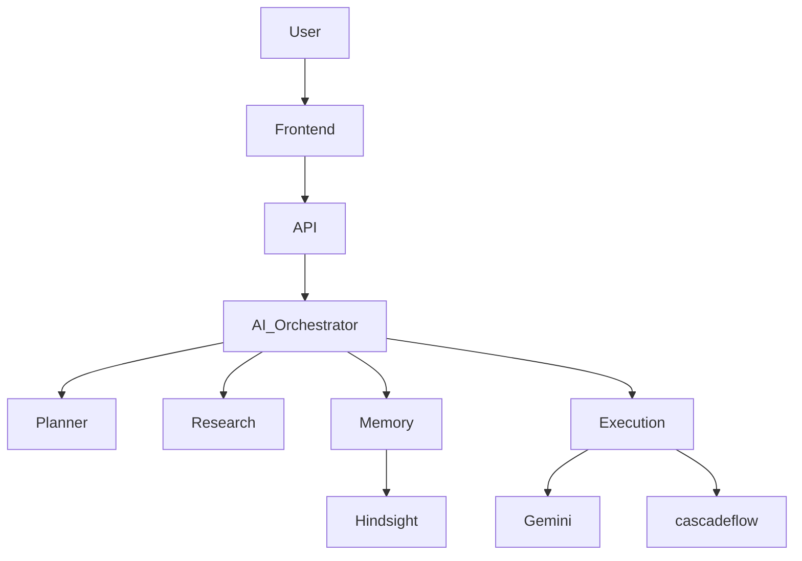

<div align="center">
  
  # DevPilot AI
  **The Next-Generation AI Operating System with Persistent Memory & Runtime Intelligence**

  []()
  []()
  []()
  []()
  []()
  []()

  [Live Demo](#) | [GitHub](#) | [Documentation](#)

  
</div>

---

## 1. Problem Statement

Existing AI assistants often lack the context to understand complex workflows over time. They suffer from:
- **Amnesia**: Forgetting previous instructions, leading to repetitive context setting.
- **Static Execution**: Inability to adjust logic dynamically at runtime based on unexpected errors or nuanced requirements.

**DevPilot AI** solves this by introducing an AI Operating System equipped with **Persistent Memory** (using Hindsight) and **Runtime Intelligence** (powered by CascadeFlow). It acts not just as an assistant, but as an autonomous developer that learns your preferences, recalls past project states, and intelligently adjusts its execution paths.

---

## 2. Features

### AI Features
- **Multi-Agent System**: Orchestrate specialized agents for research, planning, and execution.
- **Streaming AI**: Real-time response streaming for ultra-low latency feedback.

### Persistent Memory
- **Context Recall**: Seamlessly recalls past conversations and architectural decisions.
- **Reflection**: Periodically analyzes past tasks to optimize future performance.
- **Workspace Memory**: Understands your local file system, active documents, and terminal state.

### Runtime
- **Model Routing**: Intelligently selects the best Gemini model based on task complexity.
- **Budget Control & Cost Tracking**: Built-in guardrails for API usage.
- **Execution Audit**: Full transparency into agent reasoning and actions.
- **Retry Logic**: Self-healing execution loops that automatically recover from API failures.

### Platform
- **Authentication**: Secure user sessions.
- **Projects & Conversations**: Organize tasks intuitively.
- **Search & Analytics**: Powerful semantic search across your memory graph.
- **Export**: Export context and conversation histories seamlessly.

---

## 3. Architecture

DevPilot AI utilizes a highly decoupled, agentic architecture.



---

## 4. Tech Stack

- **Frontend**: React 19, TailwindCSS v4, Vite
- **Backend**: Node.js, Express, SQLite
- **AI**: Google Gemini API
- **Memory & Runtime**: Hindsight, CascadeFlow
- **Deployment**: Docker, Vercel/Render

---

## 5. Installation

```bash
git clone https://github.com/yourusername/DevPilot-AI.git
cd DevPilot-AI
npm install
npm run dev
```

---

## 6. Environment Variables

Create a `.env` file in the root directory:

```env
GEMINI_API_KEY=your_gemini_api_key
DATABASE_URL=sqlite://database.db
HINDSIGHT_KEY=your_hindsight_key
CASCADEFLOW_CONFIG=your_cascadeflow_config
```

---

## 7. Screenshots

| Home | Chat | Memory |
|------|------|--------|
|  |  |  |

| Runtime | Analytics | Settings |
|---------|-----------|----------|
|  |  |  |

---

## 8. Folder Structure

```text
AI-Operating-System/
├── .github/          # GitHub Actions, Issue/PR templates
├── docs/             # Architecture, API, deployment docs & assets
├── client/           # React frontend source code (Vite)
├── server/           # Express backend and database logic
├── shared/           # Shared types and utilities
├── scripts/          # Helper scripts for build and deployment
├── .env.example      # Environment variable template
├── package.json      # Dependencies and scripts
└── docker-compose.yml# Container orchestration
```

---

## 9. Future Improvements

- **MCP (Model Context Protocol)** Integration
- **Voice & Vision** Multimodal Capabilities
- **Plugins** Architecture for third-party extensions
- **Team Collaboration** Features
- **Enterprise Deployment** Helm charts and Kubernetes support

---

## 10. Contributors

Developed with ❤️ by the DevPilot Team.

---

## 11. License

This project is licensed under the MIT License.
