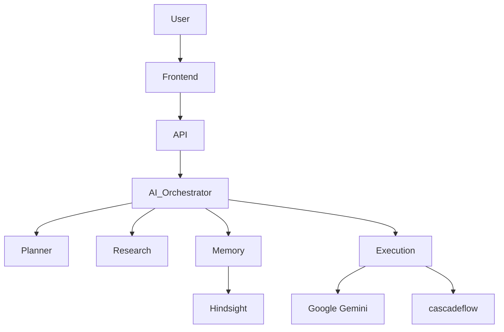
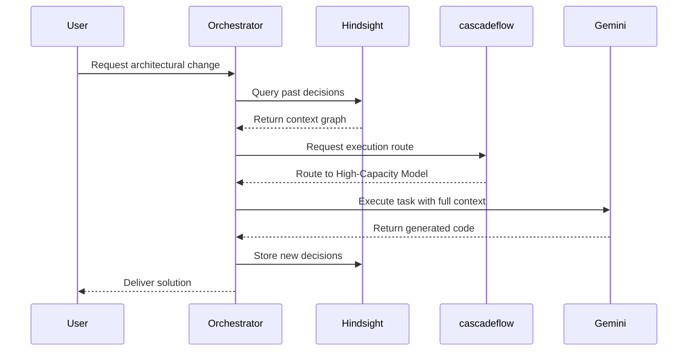

# What Changed After Our AI Stopped Forgetting
## Building Persistent AI Workflows with Hindsight and cascadeflow

The biggest limitation of today's AI assistants isn't reasoning. It's memory.

Every new session forces us to repeat architectural decisions, preferred libraries, coding conventions, and project context. After enough repetition, the assistant becomes another tool that needs constant supervision instead of a true engineering partner.

This recurring context loss transforms what should be an accelerator into a bottleneck. We realized that for AI to function as a true engineering partner, it needed an operating system designed around long-term memory and intelligent execution.

This article details the architecture and engineering decisions behind DevPilot AI, a system built to solve context amnesia and static execution in AI workflows.

[Insert Hero Screenshot]

## The Limitations of Stateless AI

Most commercial AI assistants operate on a conversational paradigm where context is bound to a single thread. This stateless approach introduces two major engineering challenges in production workflows.

First, architectural decisions are highly contextual. If an engineering team decides to handle state management in a specific way to avoid prop drilling, that decision must persist across all future code generation requests. When an AI forgets this context, it defaults to generic solutions, introducing technical debt.

Second, conversational agents apply static runtime decisions. A request to fix a simple typo and a request to design a distributed message queue are routed through the exact same inference pipeline. This static execution model ignores the reality of budget constraints, latency requirements, and task complexity. 

We needed a system that could remember past decisions and dynamically route workloads based on the complexity of the current task.

## Introducing DevPilot AI

DevPilot AI is an AI Operating System equipped with persistent memory and runtime intelligence. It shifts the paradigm from a simple chatbot to an autonomous developer environment. 

[Insert DevPilot UI Screenshot]

Instead of treating each prompt as an isolated event, the system builds an evolving understanding of the project. It knows what has been attempted, what failed, and how the current task fits into the broader architecture.

[Insert Memory Timeline Screenshot]

## System Architecture

To achieve this, we designed a highly decoupled, multi-agent architecture. By separating orchestration, memory, research, and execution, the system can scale its reasoning capabilities without creating a monolithic bottleneck.



The modularity of this system ensures that the orchestrator can pause execution, query the memory agent for historical context, and then ask the planner agent to construct a multi-step execution plan before any code is generated.

| Layer | Technology | Purpose |
| --- | --- | --- |
| Client | React 19, TypeScript, TailwindCSS | User interface and state management |
| Server | Node.js, Express | API orchestration and request handling |
| Database | SQLite | Local metadata and user state storage |
| AI Engine | Google Gemini | Core reasoning and code generation |
| Memory | Hindsight | Persistent context and knowledge graph |
| Runtime | cascadeflow | Execution auditing and dynamic routing |

[Insert Architecture Diagram]

## Persistent Memory with Hindsight

To solve context amnesia, we integrated [Hindsight](https://github.com/vectorize-io/hindsight), a specialized service for maintaining agent memory. You can read more about the principles of this approach in the [Vectorize Agent Memory](https://vectorize.io/what-is-agent-memory) documentation.

Hindsight provides the infrastructure to retain and recall context across independent sessions. When a user interacts with DevPilot AI, the Memory Agent extracts key architectural decisions and stores them. 

When a new prompt is received, the system performs a semantic search against the Hindsight knowledge graph. If the user asks the system to "add a new authentication middleware," the system automatically retrieves the context of the existing authentication service, preventing redundant or conflicting implementations.

[Insert Conversation Before vs After Memory Screenshot]

Furthermore, the system utilizes Reflection. During idle periods, the Memory Agent analyzes past execution logs to synthesize new rules or identify recurring patterns, moving ephemeral context into long-term memory. Combined with Workspace Memory—which tracks the active document and local file system state—this ensures that the agent is always grounded in the current reality of the repository.

For implementation details, refer to the [Hindsight Docs](https://hindsight.vectorize.io/).

## Runtime Intelligence with cascadeflow

While Hindsight handles memory, execution is managed by [cascadeflow](https://github.com/lemony-ai/cascadeflow). Production AI systems require runtime intelligence to balance cost, speed, and capability. 

With cascadeflow, DevPilot AI implements dynamic Model Routing. The orchestrator evaluates the incoming prompt. If the task is a simple documentation update, it routes the request to a faster, more cost-effective model variant. If the task involves complex algorithmic reasoning, it routes the workload to the most capable Google Gemini model available.

[Insert Runtime Routing Visualization]

Here is a quick look at how we initialized the routing constraints to preserve our budget without sacrificing capability for complex reasoning tasks:

```typescript
import { CascadeFlow } from 'cascadeflow';

// Initialize cascadeflow with strict budget controls and dynamic routing
const cascade = new CascadeFlow({
  apiKey: process.env.CASCADEFLOW_CONFIG,
  defaultModel: 'gemini-1.5-flash',
  routingRules: [
    {
      condition: (task) => task.complexity === 'high',
      model: 'gemini-1.5-pro'
    }
  ],
  budget: {
    maxTokensPerSession: 50000,
    enforceHardLimit: true
  }
});
```

[Insert Runtime Inspector Screenshot]

This dynamic routing is coupled with strict Budget Awareness and Cost Tracking. Administrators can define execution budgets, preventing run-away loops from exhausting API quotas. 

Additionally, cascadeflow provides Execution Auditing and Retry Logic. If Google Gemini returns an invalid JSON response or fails a validation check, the execution agent uses the audit log to understand the failure and automatically retries with a corrected prompt, ensuring the user only sees the successful output.

For further reading on runtime orchestration, consult the [cascadeflow Docs](https://docs.cascadeflow.ai/).



## Interesting Engineering Decisions

### Multi-Agent Architecture
We deliberately avoided a single "god prompt" approach. By dividing responsibilities among specialized agents (Planner, Researcher, Memory, Execution), we can tune the temperature and system prompts for each specific role. The Planner operates deterministically, while the Researcher has more creative freedom.

### Separating Memory from Execution
Memory retrieval and code generation require different optimization strategies. By isolating Hindsight from the execution engine, we can asynchronously index and query vector databases without blocking the main event loop of the execution engine.

### Isolated Runtime Intelligence
Integrating cascadeflow at the boundary between the orchestrator and the external API ensures that the core application logic remains completely agnostic to the underlying LLM provider. The orchestration layer simply requests an execution, and cascadeflow handles the retries, rate limits, and routing.

[Insert Analytics Dashboard Screenshot]

## Lessons Learned

Building persistent AI workflows taught us several counter-intuitive lessons about agentic engineering:

1. **Context is a liability if uncurated.** Simply appending every previous message into a vector database leads to retrieval noise. Reflection and summarization are mandatory to keep memory useful.
2. **Determinism requires strict orchestration.** Large language models are inherently probabilistic. Building reliable software with them requires aggressive validation steps and automatic retry loops at the runtime layer.
3. **Latency dictates user experience.** Users will tolerate a ten-second wait for a complex architectural design, but they expect instant responses for simple queries. Dynamic model routing is not just a cost-saving measure; it is a UX requirement.
4. **Visibility is critical for debugging.** When an agent makes a mistake, tracing the error through multiple agents is nearly impossible without a robust execution audit log. 
5. **State management is the hard part of AI.** The actual API calls to Google Gemini are trivial. The engineering complexity lies entirely in managing the state of the workspace, the memory graph, and the execution context.

## Future Improvements

While the current architecture handles text and code effectively, the roadmap includes several major enhancements:

* **Multimodal Vision and Voice:** Allowing the research agent to process architectural diagrams and enabling voice-driven workflows.
* **Model Context Protocol (MCP):** Standardizing how agents interact with external tools and local file systems.
* **Plugin System:** Creating an extensible architecture where developers can write custom validation or deployment steps into the execution graph.
* **Enterprise Collaboration:** Expanding the memory graph to support team-wide context, allowing an agent to recall a decision made by a different developer weeks prior.

## Conclusion

Persistent memory and runtime intelligence solve different problems, but together they change how developers interact with AI systems. One helps an agent remember. The other helps it decide. As these capabilities mature, the conversation will shift from "Which model should I use?" to "How should my agent think, remember, and execute?" That is the direction we wanted DevPilot AI to explore.

Explore the complete project on GitHub:

https://github.com/siddharthg-7/DevPilot-Ai-
